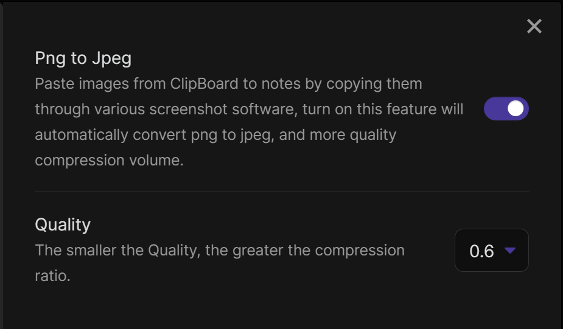

# obsidian-paste-png-to-jpeg

This plugin is inspired by [obsidian-paste-image-rename](https://github.com/reorx/obsidian-paste-image-rename), obsidian-paste-image-rename can be used when inserting images rename, I thought I could also compress and modify it when inserting, so I created this plugin

The plugin automatically handles the following when the image (png jpg jpeg) is pasted into the notes
1,Convert the image to jpeg format and compress it
2,store the image in the current notes directory in the images folder
3,Change the name of the image to the name of the current note plus a number

For example, a screenshot of hello.md will be named hello-1.jpeg...
Also you can set whether to enable image compression or not and set the quality of the image, the smaller the quality, the higher the compression rate.

